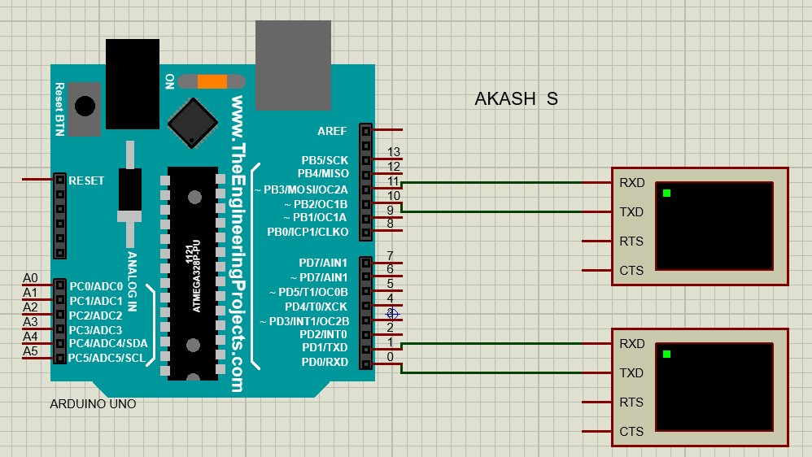
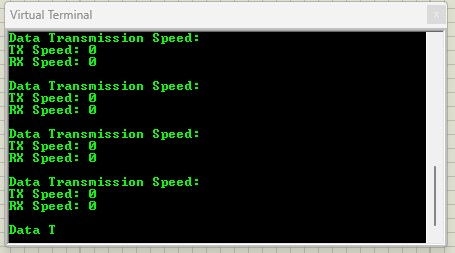
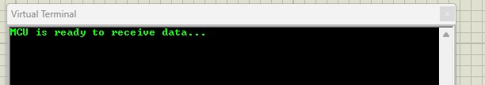
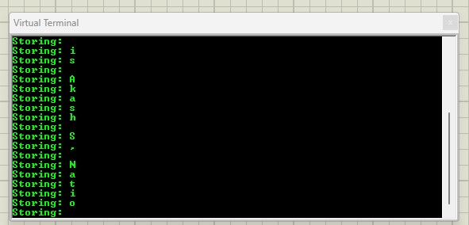
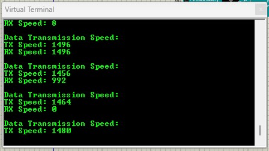
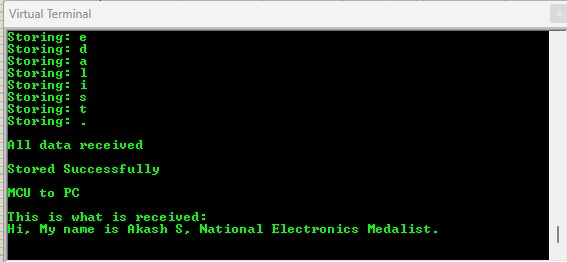

# UART Communication System with Speed Measurement and EEPROM Integration

A UART-based communication project demonstrating efficient data transmission between a PC and an MCU using a cyclic buffer, with real-time speed calculation and EEPROM storage.

## Introduction
This project implements a reliable UART communication system where data is transmitted from a PC to an MCU and back to the PC. The project focuses on live speed measurement during data transmission and seamless integration with EEPROM for data storage on the MCU.

## Novelty
- Implements a **cyclic buffer** for efficient UART communication.
- Real-time **speed measurement** of data transfer (in bits per second) using actual transmission data.
- Data stored in **EEPROM** on the MCU for non-volatile storage and easy retrieval.
- Dual virtual terminal setup in Proteus to monitor **data transmission** and **speed** independently.
- Modular code structure adhering to **Embedded C/C++ standards** for professional firmware development.

## Tech Stack
- **MCU**: Arduino Uno (Simulated in Proteus)
- **UART Communication**: 2400 Baud Rate
- **Development Environment**: PlatformIO (Visual Studio Code)
- **Programming Language**: Embedded C/C++
- **Simulation Software**: Proteus

## Project Format Tree
```
UART_Transmission/
├── .vscode/              
├── include/             
├── lib/                
├── src/                 
│   └── main.cpp         
├── test/                
├── .gitignore            
├── platformio.ini       
├── new1.pdsprj          
└── Screenshot/
|   └── outputa.jpg
|   └── output2a.jpg
|   └── output2b.jpg
|   └── output3a.jpg
|   └── output3b.jpg
|   └── console.jpg       

```

## Proteus Interfacing
- **Hardware**: Arduino Uno
- **Virtual Terminal 1**: For **data transmission and reception** monitoring.
- **Virtual Terminal 2**: For **speed measurement** display.


## Tasks Implemented

### Task 1: PC to MCU Communication
- Data sent from PC is received by the MCU over UART.
- The MCU stores the received data in EEPROM in real-time.



### Task 2: MCU to PC Communication
- Data stored in EEPROM is read back by the MCU and transmitted to the PC.
- Real-time data transfer speed is calculated and displayed.



### CONSOLE OUTPUT RESULTS


## My Details
- **Akash S**
- [LinkedIn: www.linkedin.com/in/akashnb](https://www.linkedin.com/in/akashnb)
- Mail: akashsweb@gmail.com
